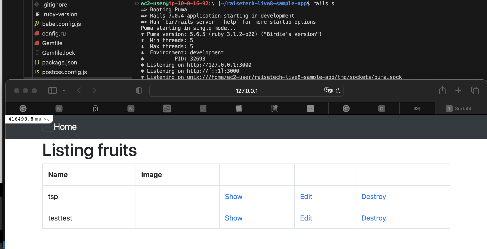
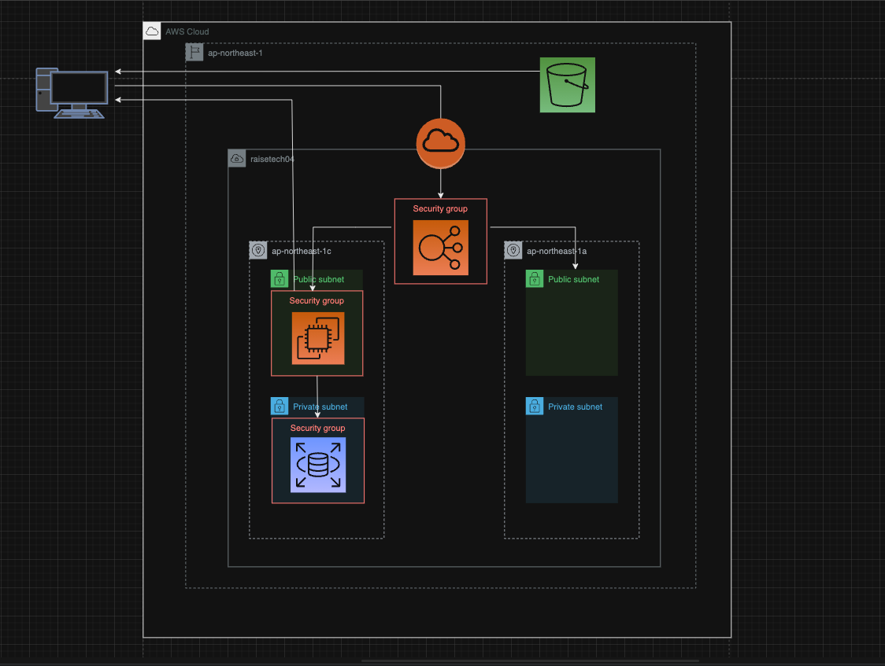

# RaiseTech AWSコース
## 第5回講義課題

### Pumaでの起動

### NginxとUnicornでの起動

### ELB経由での起動

### AWS構成図

### S3利用
 今回は下記の設定を行い、サンプルアプリケーションの画像の保存先をEC2ではなくS3へとしました。

 config/environments/production.rbをconfig.active_storage.service = :amazonへと変更

 strage.ymlに以下を追加

 	amazon:

	service: S3

	region: ap-northeast-1

	bucket: 作成した自身の「バケット名」を入力

	access_key_id: <%= ENV['AWS_ACCESS_KEY_ID'] %>

	secret_access_key:  <%= ENV['AWS_SECRET_ACCESS_KEY'] %>
	
