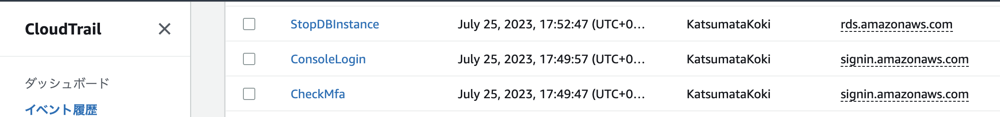
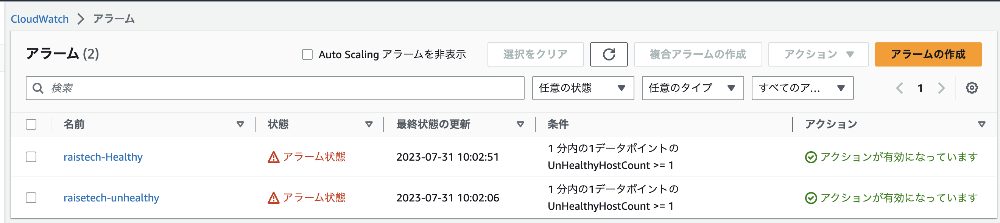
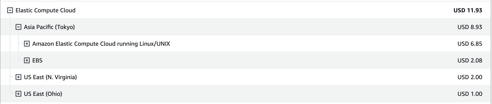

# RaiseTech AWSコース
## 第6回講義課題

### CloudTrail確認
#### データベースの一時停止操作
#### AWSマネジメントコンソールログイン
#### 2段階認証の設定確認

### CloudWatchでのアラーム設定

### 2023年6月AWS料金
 2019年より開設しているので料金は発生しています。

### 見積書作成
 https://calculator.aws/#/estimate?id=af276c00970a9653b703e6c82f26187137028dcd