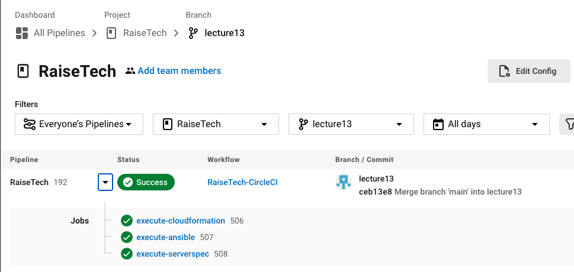
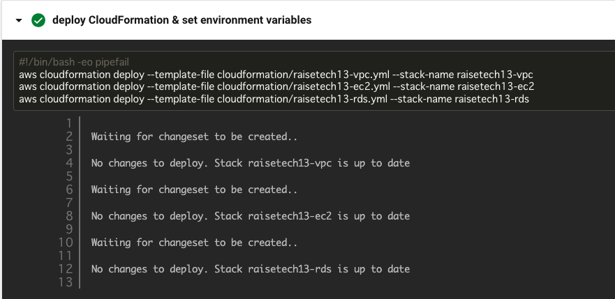
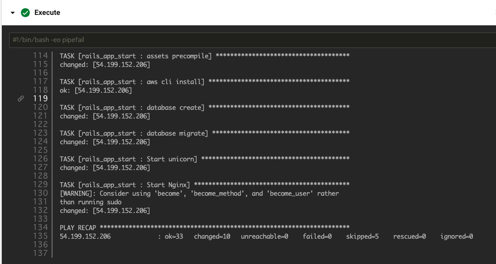
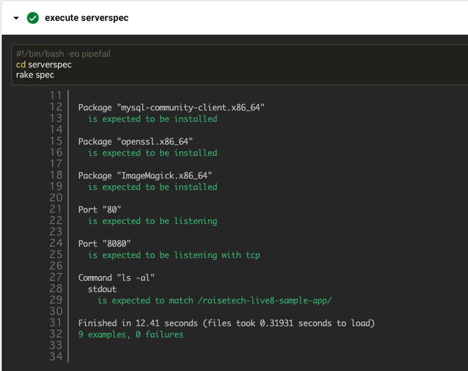

# RaiseTech AWSコース
# 第13回講義課題

## CircleCI
### 今回の課題ではローカル環境で３つのジョブが正常に実行されることを確認した後に、環境変数を利用してノンストップでジョブが実行されるように実装しました。
### .circleci/config.ymlにて、cloudformation・ansible・serverspecが実行されるように記述しております。

## execute-cloudformation

## execute-ansible

## execute-serverspec
